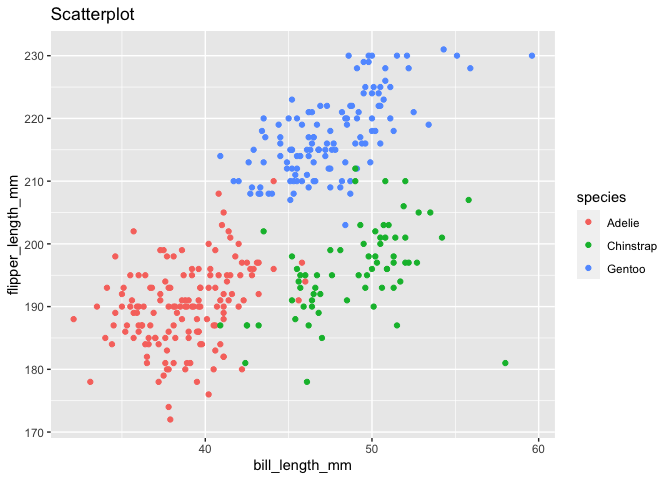

Homework 1
================
Iris (Ziyi) Wang

\#\#Problem 1 Create a data frame comprised of: - a random sample of
size 10 from a standard Normal distribution - a logical vector
indicating whether elements of the sample are greater than 0 - a
character vector of length 10 - a factor vector of length 10, with 3
different factor “levels”

``` r
prob1_df =
    tibble(
        samp = rnorm(10),
        samp_gt_0 = samp > 0,
        char_vec = c("a", "b", "c", "d", "e", "f", "g", "h", "i", "j"),
        factor_vec = c("low", "low", "low", "mod", "mod", "mod","mod", "high", "high", "high")
    )
```

Take the mean of each variable in my data frame.

``` r
mean(pull(prob1_df, samp))
```

    ## [1] 0.08470692

``` r
mean(pull(prob1_df, samp_gt_0))
```

    ## [1] 0.4

``` r
mean(pull(prob1_df, char_vec))
```

    ## Warning in mean.default(pull(prob1_df, char_vec)): argument is not numeric or
    ## logical: returning NA

    ## [1] NA

``` r
mean(pull(prob1_df, factor_vec))
```

    ## Warning in mean.default(pull(prob1_df, factor_vec)): argument is not numeric or
    ## logical: returning NA

    ## [1] NA

I can take the mean of numbers and logical but not character or factor.

``` r
as.numeric(pull(prob1_df, samp))
```

    ##  [1] -0.1694595 -0.2781553 -1.5893777 -0.7843203  0.5544320 -0.6717868
    ##  [7]  1.3310560  1.5966021 -0.1287213  0.9868000

``` r
as.numeric(pull(prob1_df, samp_gt_0))
```

    ##  [1] 0 0 0 0 1 0 1 1 0 1

``` r
as.numeric(pull(prob1_df, char_vec))
```

    ## Warning: NAs introduced by coercion

    ##  [1] NA NA NA NA NA NA NA NA NA NA

``` r
as.numeric(pull(prob1_df, factor_vec))
```

    ## Warning: NAs introduced by coercion

    ##  [1] NA NA NA NA NA NA NA NA NA NA

I can convert logical variable to numeric variable, but I cannot convert
character and factor variables to numeric variables. So this does
explain the reason why I get the error messages when I was trying to
take the mean of character and factor variables while it is fine to take
the mean of my numeric and logical variables.

``` r
# convert the logical vector to numeric, and multiply the random sample by the result
as.numeric(pull(prob1_df, samp_gt_0)) * pull(prob1_df, samp)
```

    ##  [1] 0.000000 0.000000 0.000000 0.000000 0.554432 0.000000 1.331056 1.596602
    ##  [9] 0.000000 0.986800

``` r
# convert the logical vector to a factor, and multiply the random sample by the result
as.factor(pull(prob1_df, samp_gt_0)) * pull(prob1_df, samp)
```

    ## Warning in Ops.factor(as.factor(pull(prob1_df, samp_gt_0)), pull(prob1_df, : '*'
    ## not meaningful for factors

    ##  [1] NA NA NA NA NA NA NA NA NA NA

``` r
# convert the logical vector to a factor and then convert the result to numeric, and multiply the random sample by the result
as.numeric(as.factor(pull(prob1_df, samp_gt_0))) * pull(prob1_df, samp)
```

    ##  [1] -0.1694595 -0.2781553 -1.5893777 -0.7843203  1.1088640 -0.6717868
    ##  [7]  2.6621121  3.1932042 -0.1287213  1.9736000

## Problem 2

``` r
#install.packages("palmerpenguins")
data("penguins", package = "palmerpenguins")
```

  - Write a short description of the penguins dataset using inline R
    code, including:

<!-- end list -->

1.  the data in this dataset, including names / values of important
    variables

<!-- end list -->

``` r
summary(penguins)
```

    ##       species          island    bill_length_mm  bill_depth_mm  
    ##  Adelie   :152   Biscoe   :168   Min.   :32.10   Min.   :13.10  
    ##  Chinstrap: 68   Dream    :124   1st Qu.:39.23   1st Qu.:15.60  
    ##  Gentoo   :124   Torgersen: 52   Median :44.45   Median :17.30  
    ##                                  Mean   :43.92   Mean   :17.15  
    ##                                  3rd Qu.:48.50   3rd Qu.:18.70  
    ##                                  Max.   :59.60   Max.   :21.50  
    ##                                  NA's   :2       NA's   :2      
    ##  flipper_length_mm  body_mass_g       sex           year     
    ##  Min.   :172.0     Min.   :2700   female:165   Min.   :2007  
    ##  1st Qu.:190.0     1st Qu.:3550   male  :168   1st Qu.:2007  
    ##  Median :197.0     Median :4050   NA's  : 11   Median :2008  
    ##  Mean   :200.9     Mean   :4202                Mean   :2008  
    ##  3rd Qu.:213.0     3rd Qu.:4750                3rd Qu.:2009  
    ##  Max.   :231.0     Max.   :6300                Max.   :2009  
    ##  NA's   :2         NA's   :2

2.  the size of the dataset is 344 (rows) by 8 (columns).

3.  the mean flipper length is 200.9152047mm.

<!-- end list -->

  - Make a scatterplot of flipper\_length\_mm (y) vs bill\_length\_mm
    (x); color points using the species variable (adding color = …
    inside of aes in your ggplot code should help).

<!-- end list -->

``` r
ggplot(penguins, 
       aes(x = bill_length_mm, 
           y = flipper_length_mm, 
           color = species)) + geom_point() + ggtitle("Scatterplot")
```

    ## Warning: Removed 2 rows containing missing values (geom_point).

<!-- -->

  - Export your first scatterplot to your project directory using
    ggsave.

<!-- end list -->

``` r
ggsave("plot.pdf", height = 5, width = 5)
```

    ## Warning: Removed 2 rows containing missing values (geom_point).
